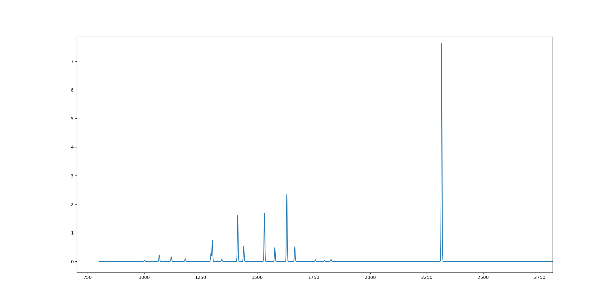

# adpy_proj
 - Project for the week-long "Advanced Scientific Python" class at Uppsala University

The project is titled "Full cycle - from structure to analysis using Gaussian and Atomic Simulation Environment". 
One aim of my PhD project is to work with experimentalists to develop a symbiotic relationship where their work can be supported by my calculations, and vice versa. A milestone in this project is to simplify for experimentalists to compare measured results to computed ditto. This here project is devoted to develop a package with which one could simply choose which molecules they would like to perform their calculations on, with which methods they would like to perform their calculations, which analyses they would like to perform etc. Then they will press enter, calculations will be performed and they will get a summary consisting of the chosen analyses.

The coding would consist of working with ASE ("Atomic Simulation Environment") and its Python interface to perform calculations in Gaussian, summarise the wanted results and present them using numpy and matplotlib.

https://wiki.fysik.dtu.dk/ase/

https://gaussian.com/gaussian16/
